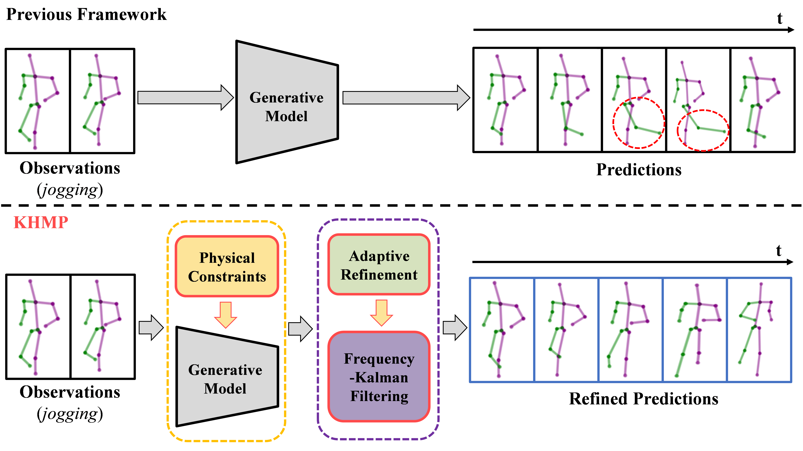
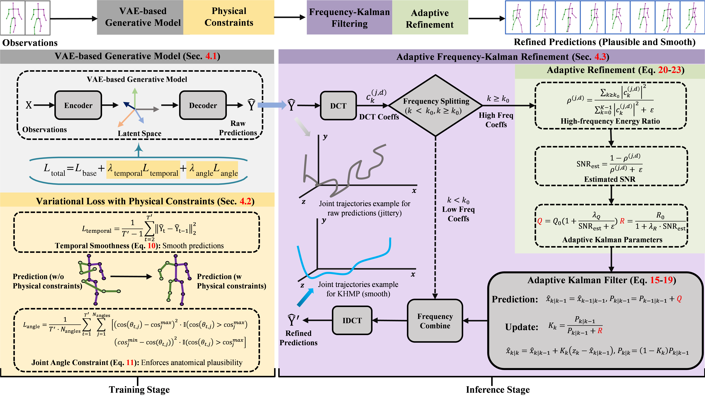
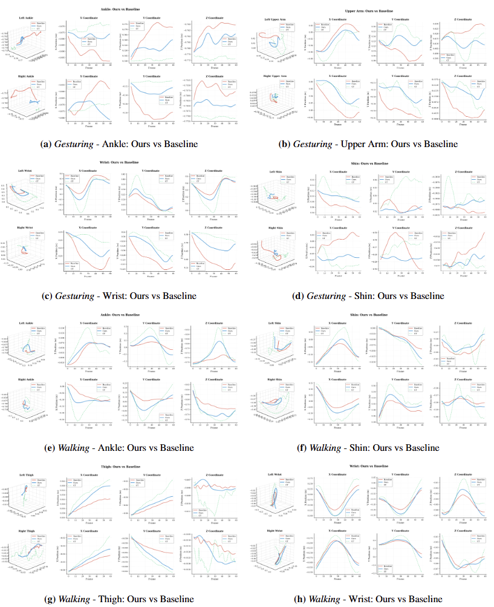
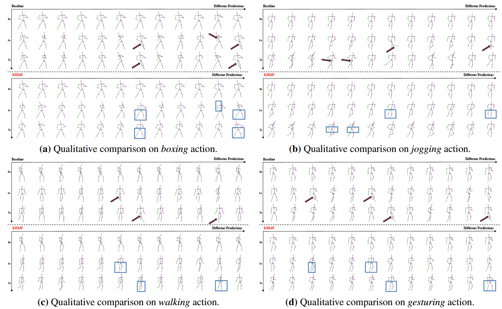

# KHMP: Frequency-Domain Kalman Refinement for High-Fidelity Human Motion Prediction

  <a href="https://arxiv.org/abs/2603.21327">arXiv</a>
  &nbsp;|&nbsp;
  <a href="https://github.com/wenhanwu95/KHMP-Project-Page">GitHub</a>

  Wenhan Wu1,2, Zhishuai Guo3, Chen Chen4, Srijan Das2, Hongfei Xue2, Pu Wang2, Aidong Lu2

  1School of Engineering, Yunnan University, Kunming, Yunnan, China 
  2Department of Computer Science, University of North Carolina at Charlotte, Charlotte, NC, USA 
  3Department of Computer Science, Northern Illinois University, DeKalb, IL, USA 
  4Institute of Artificial Intelligence, University of Central Florida, Orlando, FL, USA

## Abstract

Stochastic human motion prediction aims to generate diverse, plausible futures from observed sequences. Despite advances in generative modeling, existing methods often produce predictions corrupted by high-frequency jitter and temporal discontinuities. To address these challenges, we introduce KHMP, a novel framework featuring an adaptive Kalman filter applied in the DCT domain to generate high-fidelity human motion predictions. By treating high-frequency DCT coefficients as a frequency-indexed noisy signal, the Kalman filter recursively suppresses noise while preserving motion details. Notably, its noise parameters are dynamically adjusted based on estimated Signal-to-Noise Ratio (SNR), enabling aggressive denoising for jittery predictions and conservative filtering for clean motions. This refinement is complemented by training-time physical constraints (temporal smoothness and joint angle limits) that encode biomechanical principles into the generative model. Together, these innovations establish a new paradigm integrating adaptive signal processing with physics-informed learning. Experiments on the Human3.6M and HumanEva-I datasets demonstrate that KHMP achieves state-of-the-art accuracy, effectively mitigating jitter artifacts to produce smooth and physically plausible motions.

## Overview

KHMP is built around two key innovations:

1. **Adaptive frequency-domain Kalman refinement**  
   KHMP applies an adaptive Kalman filter in the DCT domain to refine predicted motion sequences. By treating high-frequency coefficients as noisy signals and dynamically adjusting the filtering strength according to the estimated SNR, KHMP effectively suppresses jitter while preserving meaningful motion details.

2. **Physics-informed training constraints**  
   KHMP incorporates temporal smoothness and joint angle limit constraints during training to inject biomechanical priors into the motion generation process, leading to more stable and physically plausible predictions.

## Motivation

### Why is KHMP needed?

Existing stochastic human motion prediction models face two major challenges:

1. **Lack of adaptive frequency-aware refinement**  
   High-frequency noise introduced by stochastic sampling often leads to visible jitter and temporal discontinuity.

2. **Lack of explicit biomechanical constraints**  
   Frame-wise reconstruction objectives alone do not sufficiently enforce physically plausible motion.

KHMP addresses both issues with a unified framework that combines physical constraints during training and adaptive frequency-domain Kalman refinement during inference.

## Comparison illustrating motion prediction

  

  <em>Comparison illustrating motion prediction.</em>

Previous stochastic prediction frameworks often generate predictions exhibiting physical implausibility and abrupt temporal transitions. KHMP produces more plausible and temporally smoother motion sequences.

## Overview of the proposed KHMP framework

  

  <em>Overview of the proposed KHMP framework.</em>

KHMP consists of two complementary components:

### 1. Physics-informed training
During training, KHMP introduces:
- temporal smoothness constraints
- joint angle limit constraints

These constraints improve motion realism and reduce physically implausible predictions.

### 2. Frequency-domain adaptive Kalman refinement
During inference, KHMP:
- transforms predicted motion into the DCT domain
- separates low-frequency motion structure from high-frequency noisy components
- applies an adaptive Kalman filter to the high-frequency spectrum
- reconstructs refined motion through inverse DCT

This design effectively suppresses jitter while preserving detailed motion patterns.

## Visual comparison of joint trajectories

  

  <em>Visual comparison of joint trajectories.</em>

KHMP significantly improves trajectory smoothness across different body parts. Compared with the baseline, the refined trajectories better follow the ground truth and exhibit substantially less high-frequency oscillation.

## Visual comparison highlighting KHMP’s enhanced prediction quality

  

  <em>Visual comparison highlighting KHMP’s enhanced prediction quality.</em>

KHMP consistently produces smoother temporal evolution, more stable body articulation, fewer jitter artifacts, and more physically plausible pose transitions.

## Quantitative Comparison

Best results are highlighted in **bold** in each column.

<table style="font-size:12px;">
  <thead>
    <tr>
      <th rowspan="2">Method</th>
      <th rowspan="2">Venue</th>
      <th colspan="5">HumanEva-I</th>
      <th colspan="5">Human3.6M</th>
    </tr>
    <tr>
      <th>APD↑</th>
      <th>ADE↓</th>
      <th>FDE↓</th>
      <th>MMADE↓</th>
      <th>MMFDE↓</th>
      <th>APD↑</th>
      <th>ADE↓</th>
      <th>FDE↓</th>
      <th>MMADE↓</th>
      <th>MMFDE↓</th>
    </tr>
  </thead>
  <tbody>
    <tr>
      <td>ERD</td>
      <td>ICCV 2015</td>
      <td>0</td>
      <td>0.382</td>
      <td>0.461</td>
      <td>0.521</td>
      <td>0.595</td>
      <td>0</td>
      <td>0.722</td>
      <td>0.969</td>
      <td>0.776</td>
      <td>0.995</td>
    </tr>
    <tr>
      <td>DeLiGAN</td>
      <td>CVPR 2017</td>
      <td>2.177</td>
      <td>0.306</td>
      <td>0.322</td>
      <td>0.385</td>
      <td>0.371</td>
      <td>6.509</td>
      <td>0.483</td>
      <td>0.534</td>
      <td>0.520</td>
      <td>0.545</td>
    </tr>
    <tr>
      <td>BoM</td>
      <td>CVPR 2018</td>
      <td>2.846</td>
      <td>0.271</td>
      <td>0.279</td>
      <td>0.373</td>
      <td>0.351</td>
      <td>6.265</td>
      <td>0.448</td>
      <td>0.533</td>
      <td>0.514</td>
      <td>0.544</td>
    </tr>
    <tr>
      <td>DLow</td>
      <td>ECCV 2020</td>
      <td>4.855</td>
      <td>0.251</td>
      <td>0.268</td>
      <td>0.362</td>
      <td>0.339</td>
      <td>11.741</td>
      <td>0.425</td>
      <td>0.518</td>
      <td>0.495</td>
      <td>0.531</td>
    </tr>
    <tr>
      <td>DSF</td>
      <td>ICLR 2020</td>
      <td>4.538</td>
      <td>0.273</td>
      <td>0.290</td>
      <td>0.364</td>
      <td>0.340</td>
      <td>9.330</td>
      <td>0.493</td>
      <td>0.592</td>
      <td>0.550</td>
      <td>0.599</td>
    </tr>
    <tr>
      <td>GSPS</td>
      <td>ICCV 2021</td>
      <td>5.825</td>
      <td>0.233</td>
      <td>0.244</td>
      <td>0.343</td>
      <td>0.331</td>
      <td>14.757</td>
      <td>0.389</td>
      <td>0.496</td>
      <td>0.476</td>
      <td>0.525</td>
    </tr>
    <tr>
      <td>MOJO</td>
      <td>CVPR 2021</td>
      <td>4.181</td>
      <td>0.234</td>
      <td>0.260</td>
      <td>0.344</td>
      <td>0.339</td>
      <td>12.579</td>
      <td>0.412</td>
      <td>0.514</td>
      <td>0.497</td>
      <td>0.538</td>
    </tr>
    <tr>
      <td>DivSamp</td>
      <td>ACM MM 2022</td>
      <td>6.109</td>
      <td>0.220</td>
      <td>0.234</td>
      <td>0.342</td>
      <td>0.316</td>
      <td>15.310</td>
      <td>0.370</td>
      <td>0.485</td>
      <td>0.475</td>
      <td>0.516</td>
    </tr>
    <tr>
      <td>STARS</td>
      <td>ECCV 2022</td>
      <td>6.031</td>
      <td>0.217</td>
      <td>0.241</td>
      <td>0.328</td>
      <td>0.321</td>
      <td><b>15.884</b></td>
      <td>0.358</td>
      <td>0.445</td>
      <td>0.442</td>
      <td>0.471</td>
    </tr>
    <tr>
      <td>MotionDiff</td>
      <td>AAAI 2023</td>
      <td>5.931</td>
      <td>0.232</td>
      <td>0.236</td>
      <td>0.352</td>
      <td>0.320</td>
      <td>15.353</td>
      <td>0.411</td>
      <td>0.509</td>
      <td>0.508</td>
      <td>0.536</td>
    </tr>
    <tr>
      <td>Belfusion</td>
      <td>ICCV 2023</td>
      <td>-</td>
      <td>-</td>
      <td>-</td>
      <td>-</td>
      <td>-</td>
      <td>7.602</td>
      <td>0.372</td>
      <td>0.474</td>
      <td>0.473</td>
      <td>0.507</td>
    </tr>
    <tr>
      <td>HumanMAC</td>
      <td>ICCV 2023</td>
      <td>6.554</td>
      <td>0.209</td>
      <td>0.223</td>
      <td>0.342</td>
      <td>0.320</td>
      <td>6.301</td>
      <td>0.369</td>
      <td>0.480</td>
      <td>0.509</td>
      <td>0.545</td>
    </tr>
    <tr>
      <td>TransFusion</td>
      <td>RA-L 2024</td>
      <td>1.031</td>
      <td>0.204</td>
      <td>0.234</td>
      <td>0.408</td>
      <td>0.427</td>
      <td>5.975</td>
      <td>0.358</td>
      <td>0.468</td>
      <td>0.506</td>
      <td>0.539</td>
    </tr>
    <tr>
      <td>CoMotion</td>
      <td>ECCV 2024</td>
      <td>-</td>
      <td>-</td>
      <td>-</td>
      <td>-</td>
      <td>-</td>
      <td>7.632</td>
      <td>0.350</td>
      <td>0.458</td>
      <td>0.494</td>
      <td>0.506</td>
    </tr>
    <tr>
      <td>SkeletonDiff</td>
      <td>CVPR 2025</td>
      <td>-</td>
      <td>-</td>
      <td>-</td>
      <td>-</td>
      <td>-</td>
      <td>7.249</td>
      <td><b>0.344</b></td>
      <td>0.450</td>
      <td>0.487</td>
      <td>0.512</td>
    </tr>
    <tr>
      <td>MotionMap</td>
      <td>CVPR 2025</td>
      <td>-</td>
      <td>-</td>
      <td>-</td>
      <td>-</td>
      <td>-</td>
      <td>7.840</td>
      <td>0.474</td>
      <td>0.598</td>
      <td>0.466</td>
      <td>0.532</td>
    </tr>
    <tr>
      <td>SOGM</td>
      <td>DSP 2025</td>
      <td>6.761</td>
      <td>0.217</td>
      <td>0.217</td>
      <td>0.337</td>
      <td>0.322</td>
      <td>15.877</td>
      <td>0.367</td>
      <td>0.484</td>
      <td>0.495</td>
      <td>0.529</td>
    </tr>
    <tr>
      <td>Baseline*</td>
      <td>–</td>
      <td>6.516</td>
      <td>0.196</td>
      <td>0.211</td>
      <td>0.314</td>
      <td>0.303</td>
      <td>8.217</td>
      <td>0.357</td>
      <td>0.445</td>
      <td>0.438</td>
      <td>0.470</td>
    </tr>
    <tr>
      <td><b>KHMP (Ours)</b></td>
      <td>–</td>
      <td><b>7.481</b></td>
      <td><b>0.188</b></td>
      <td><b>0.204</b></td>
      <td><b>0.301</b></td>
      <td><b>0.291</b></td>
      <td>9.235</td>
      <td>0.349</td>
      <td><b>0.441</b></td>
      <td><b>0.436</b></td>
      <td><b>0.468</b></td>
    </tr>
  </tbody>
</table>

## Updates

- **2026.3.22:** the GitHub project page was created.
- **2026.3.24:** the arXiv paper is online.
